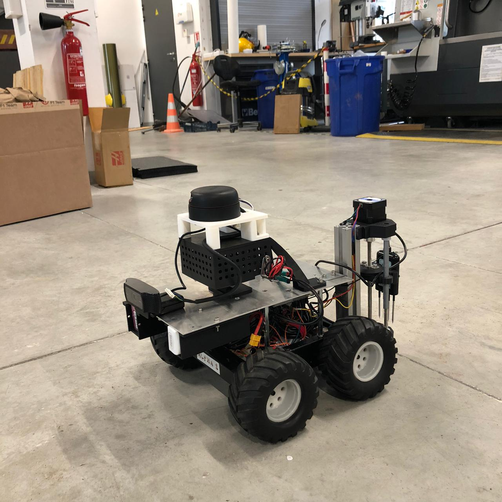

# AGRI-Scout 🚜
**Autonomous Agricultural Inspection Robot**

AGRI-Scout est un robot agricole différentiel autonome à quatre roues motrices, conçu pour la navigation dans les rangées de cultures et l'analyse de sol in-situ. Il combine la vision par ordinateur, un LiDAR, et une sonde à vis motorisée pour récolter des données pédologiques en temps réel.



🎥 **[Voir la démo vidéo sur YouTube](https://www.youtube.com/shorts/bMWXOjUjSsw)**

---

## 📑 Sommaire
1. [Caractéristiques Principales](#-caractéristiques-principales)
2. [Architecture Matérielle](#-architecture-matérielle)
3. [Architecture Logicielle](#-architecture-logicielle)
4. [Installation et Prérequis](#-installation-et-prérequis)
5. [Démarrage Rapide](#-démarrage-rapide)
6. [Documentation](#-documentation)
7. [Auteurs](#-auteurs)

---

## 🌟 Caractéristiques Principales

* **Navigation Autonome :** Suivi de ligne blanche au sol via vision par ordinateur (OpenCV) avec contrôleur PD.
* **Évitement d'Obstacles :** Surveillance périmétrique en temps réel grâce au RPLiDAR pour prévenir les collisions.
* **Analyse de Sol Automatisée :** Déploiement mécanique d'une sonde à vis motorisée par un moteur pas-à-pas NEMA 17.
* **Acquisition de Données :** Capteur industriel RS485 (Modbus RTU) mesurant 8 paramètres vitaux : NPK (Azote, Phosphore, Potassium), pH, Température, Humidité, Conductivité Électrique et Salinité.
* **Architecture Distribuée :** Prise de décision par Raspberry Pi 4 (ROS 2 Jazzy) et contrôle bas niveau temps réel par Arduino UNO avec un protocole de communication sécurisé (\textit{watchdog}).

---

## 🛠️ Architecture Matérielle

Le robot est structuré sur deux étages pour isoler physiquement l'électronique de puissance et l'électronique de traitement.

### Composants Clés
* **Calculateur Principal :** Raspberry Pi 4 Model B (4GB)
* **Contrôleur Moteur :** Arduino UNO R3
* **Actionneurs :** 
  * 4x Moteurs DC brushed (Traction, skid-steering)
  * 1x Moteur pas-à-pas NEMA 17 (Sonde)
* **Capteurs :**
  * RPLiDAR (USB)
  * Webcam USB (V4L2)
  * Capteur de sol NPK 8-en-1 (RS485 vers USB)
  * SparkFun OpenLog Artemis (UART)

### Système d'Alimentation
Afin d'éviter les chutes de tension (brown-outs) induites par les appels de courant des moteurs, le système dispose de 3 circuits indépendants :
1. **Batterie LiPo 5000 mAh (3S) :** Moteurs de traction et ESC.
2. **Batterie LiPo 2200 mAh (3S) :** Moteur de la sonde (via Pont en H L298N).
3. **Powerbank USB-C 5V :** Alimentation exclusive du Raspberry Pi.

---

## 💻 Architecture Logicielle

Le projet s'appuie sur le framework **ROS 2 Jazzy** sous Ubuntu 24.04 (ou 22.04 pour versions antérieures compatibles).

* `agri_line_follower.py` : Nœud central intégrant la machine à états finis (FOLLOWING / HARVESTING).
* `agri_demo_hunter.py` : Mode de démonstration pour traquer un objet coloré plutôt qu'une ligne.
* `ros2_teleop.py` : Contrôle manuel du robot via SSH.
* `main_firmware.ino` : Firmware Arduino avec protocole binaire protégé par XOR Checksum et Watchdog matériel.

---

## 🚀 Installation et Prérequis

### Prérequis Logiciels (Raspberry Pi)
* Ubuntu Server/Desktop 24.04
* ROS 2 Jazzy
* Python 3 avec `opencv-python`, `pyserial`, `numpy`

### Clonage et Compilation
```bash
# Cloner le dépôt
git clone https://github.com/VOTRE_UTILISATEUR/AGRI-Scout.git
cd AGRI-Scout/agri-scout-modif

# Sourcer l'environnement ROS 2
source /opt/ros/jazzy/setup.bash

# Compiler l'espace de travail
colcon build --packages-select <nom_des_packages>
```

---

## 🏁 Démarrage Rapide

Pour les instructions détaillées, veuillez consulter le manuel utilisateur (User Manual) dans le dossier de documentation.

1. **Mise sous tension** : 
   - Branchez la Powerbank au Raspberry Pi.
   - Branchez la batterie LiPo 5000mAh et activez l'interrupteur principal.
   - Branchez la batterie LiPo 2200mAh.
2. **Connexion SSH** :
   ```bash
   ssh ubuntu@<IP_DU_RASPBERRY_PI>
   # Mot de passe par défaut : agribot
   ```
3. **Lancement de la Mission Autonome** :
   ```bash
   source /opt/ros/jazzy/setup.bash
   cd ~/AGRI-Scout_Modif
   source install/setup.bash
   ros2 launch ~/AGRI-Scout_Modif/demo.launch.py
   ```

---

## 📚 Documentation

L'intégralité de la documentation technique est disponible au format PDF compilé à partir des sources LaTeX dans `agri-scout-modif/documentation_latex/` :
- **01 Quick Start Guide** : Pour un démarrage immédiat.
- **02 User Manual** : Description détaillée de tous les modes d'utilisation.
- **03 Hardware Maintenance Manual** : Références des pièces, montage, impression 3D et débogage.
- **04 Developer Manual** : Architecture logicielle détaillée et protocole de communication.
- **05 Rapport d'Avancement** : Historique du projet, solutions explorées et perspectives.

---

## 👥 Auteurs

Ce projet a été réalisé par :
* **Pedro Alves**
* **Luiz Felipe**

*Projet réalisé dans le cadre de l'Unité d'Enseignement 3.4 / 4.4 à l'ENSTA Campus de Brest.*
